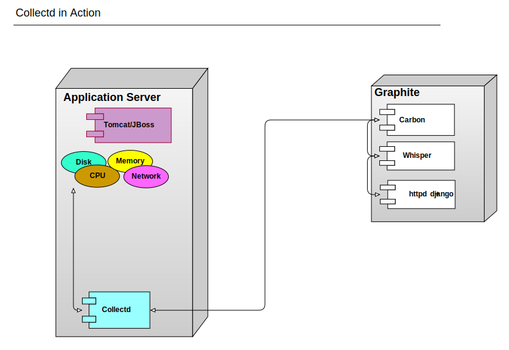
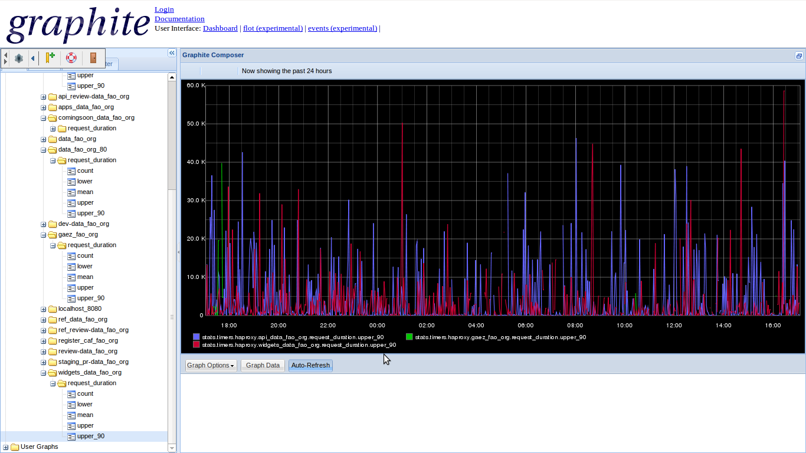
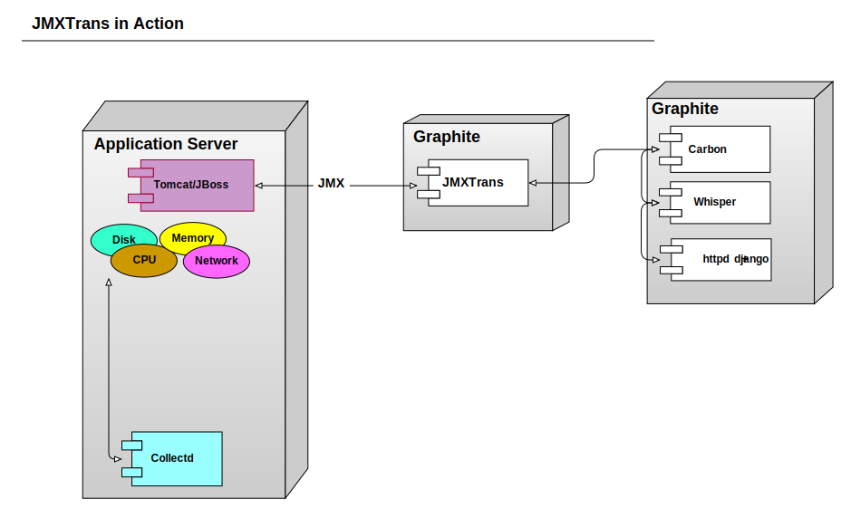
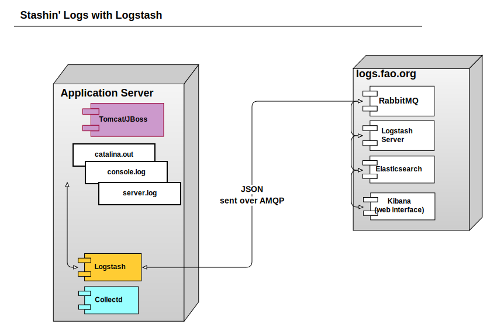
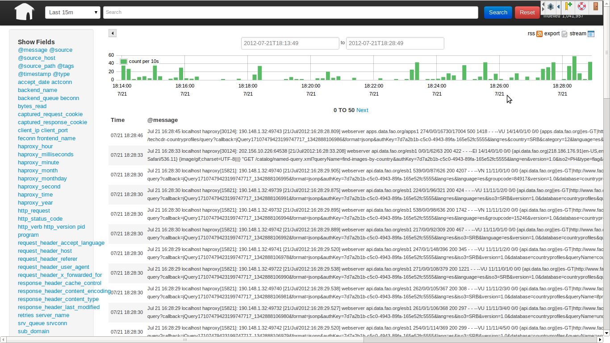
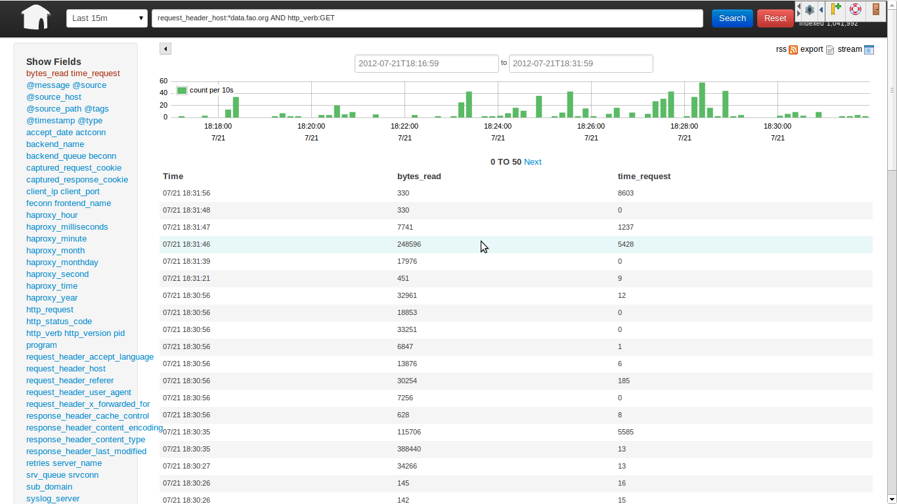
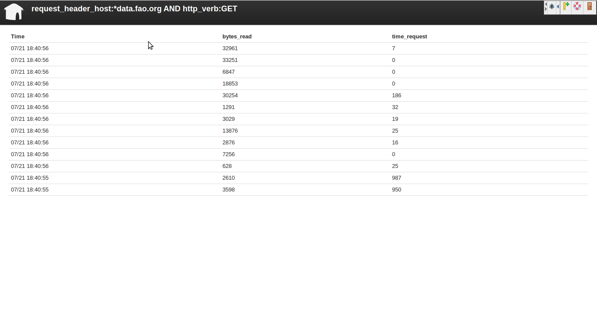

!SLIDE
# A New Hope

 
 
 

Monitoring  data.fao.org  

</img>

.notes http://www.ironicsans.com/images/anewhope.png

!SLIDE
# Overview

* What we have now
* Why it sucks
* What might be better
* What you can do

!SLIDE
# We have a complicated application stack

systematic monitoring is critical to
untangling it
 

.notes http://dummyatcooking.files.wordpress.com/2007/10/spaghetti-bolognese.jpg
                                         
!SLIDE
# We currently use Nagios and RHQ

!SLIDE
# Downsides

 
 

* Graphing capabilities in Nagios+Cacti very limited
* Nagios is a pain to configure, even with Chef
* RHQ is powerful but very inflexible

!SLIDE
# More RHQ Issues
 
 

* The RHQ agent consumes non-trivial amount of RAM and CPU
* Extending it requires you to write Java class and a Maven pom.xml
* Small user community despite being a relatively mature project
* No easy way to access data in RHQ to create dashboards   or do computations on data

!SLIDE
# That Makes me Want to...

</img>

.notes http://3.bp.blogspot.com/-RAPTS9vZKKw/TZB8Zf7HSpI/AAAAAAAAEmA/5uSAjc4xfsc/s1600/the-scream.jpg

!SLIDE
# A New Hope

* A more flexible monitoring system
* We will continue to use Nagios for alerting
* The future use of RHQ is uncertain
 
 

The DevOps Community has (mostly) converged on a toolchain for monitoring

!SLIDE
# What is a metric?

* a name
* a value
* a timestamp, typically the UNIX epoch time
 

stats.haproxy.data_fao_org.request_duration   330 74857843

 

!SLIDE 
# Collectd for system metrics

</img>

!SLIDE
# Collectd is good

* lightweight C daemon
* monitors continuously, not once every 5 minutes
* Best for OS-level metrics such as CPU, Disk, Memory, etc. 

!SLIDE
# What's Graphite?

* Time Series Database (Whisper)
* Rendering Engine 
* Dashboard (Graphite-Web)
* data relay and aggregation (Carbon)
 

!SLIDE
# Here is a taste
 

</img>

We'll come back to this later!

!SLIDE
# Let's take a look at that JVM

</img>

!SLIDE
# JMXTrans

* Is just a connector for transporting JMX data
* No agent involved

!SLIDE
# What about those logs?

</img>

We don't only care about metrics, we also care about important
events.   Would be nice to scrape metrics from logs though.

!SLIDE
# Show me the graphic already!

!SLIDE
# Logstash can more than just ship logs

* Win
  * index by field
  * shape data
  * add new fields and tags to entries
  * Elasticsearch backend is awwwes0me

* Con - The agent isn't so light on resource usage

!SLIDE
# Logs don't have to be Ugly

!SLIDE
# We can filter the data

!SLIDE
# UNIX Tail in your browser

!SLIDE
# Elasticsearch Rocks

* We can use [Lucene Parser
  Syntax](https://lucene.apache.org/core/old_versioned_docs/versions/3_5_0/queryparsersyntax.html)
  to construct queries
* Watch out though, don't use quotes, the 1st example here works, the
  second doesn't
 

status_code:40* AND request_header_host:*fao_org

 
 

status_code:"40*" AND request_header_host:"*fao_org"

!SLIDE
# Listen

Be sure to listen to the FoodFightShow!

