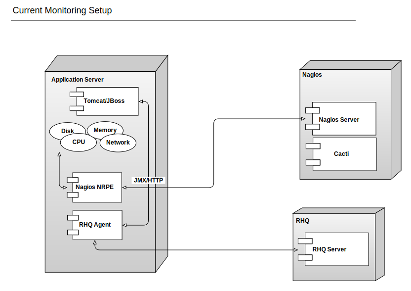

!SLIDE
# A New Hope

 
 
 

Monitoring  data.fao.org  

</img>

.notes http://www.ironicsans.com/images/anewhope.png

!SLIDE
# Overview

* What we have now
* Why it sucks
* What might be better
* What you can do

!SLIDE
# We have a complicated application stack

systematic monitoring is critical to
untangling it
 

.notes http://dummyatcooking.files.wordpress.com/2007/10/spaghetti-bolognese.jpg
                                         
!SLIDE
# We currently use Nagios and RHQ

!SLIDE
# Downsides of current approach

 
 
* Graphing capabilities in Nagios+Cacti very limited
* Nagios is a pain to configure, even with Chef
* RHQ is powerful but very inflexible

!SLIDE
# More RHQ issues

* The RHQ agent consumes non-trivial amount of RAM and CPU
* Extending it requires you to write Java class and a Maven pom.xml (The Horror!)
* Small user community despite being a relatively mature project
* No easy way to access data in RHQ to create dashboards or do
 computations on data

</img>

.notes http://3.bp.blogspot.com/-RAPTS9vZKKw/TZB8Zf7HSpI/AAAAAAAAEmA/5uSAjc4xfsc/s1600/the-scream.jpg

!SLIDE
# Listen

Be sure to listen to the FoodFightShow!

